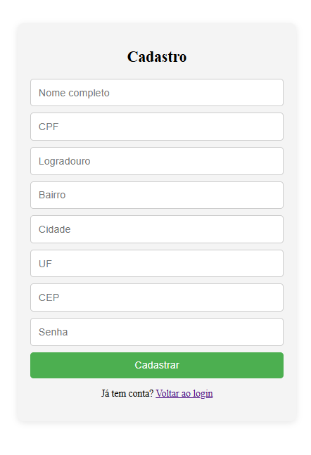
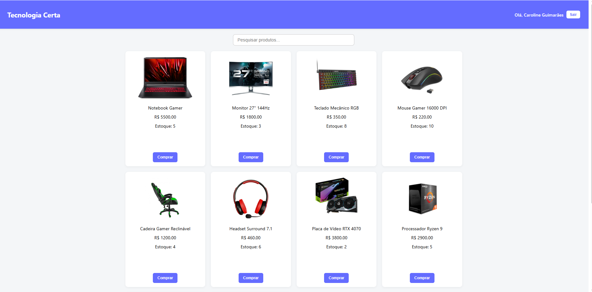

<h1 align="center"> Sistema de Gerenciamento de Estoque </h1>
<p align="center">
<a href="#-tecnologias">Tecnologias</a>&nbsp;&nbsp;&nbsp;|&nbsp;&nbsp;&nbsp;
<a href="#-projeto">Projeto</a>&nbsp;&nbsp;&nbsp;|&nbsp;&nbsp;&nbsp;
<a href="#-layout">Layout</a>
</p>
</br>
<p>✨ Principais Funcionalidades:</p>
  <p>👤 Cadastro e login de usuário</p>
  <p>🧾 Geração de boletos em PDF para download</p>
  <p>🔍 Pesquisa de produtos</p>

<br>

## 🚀 Tecnologias
Esse projeto foi desenvolvido com as seguintes tecnologias:
 
- Vuejs
- Git e Github
 
## 💻 Projeto
 
O Tecnologia Certa é um sistema de gerenciamento de estoque
focado em produtos de tecnologia. A aplicação permite o controle de usuários, produtos e ainda gera boletos em PDF. 

## ⚡ Como baixar o projeto
</br>
 
```bash
# Clonar o repositório
$ git clone https://github.com/CarolGuimaraess/Tecnologia-Certa.git

# Entrar no diretório
$ cd Tecnologia-Certa
 
# Instalar as dependências
$ npm install
 
# Iniciar o projeto
$ npm run dev
```

## 🔖 Layout

<p align="center">

</p>
<p align="center">

</p>
<p align="center">

</p>
<p align="center">

</p>
<p align="center">

</p>
