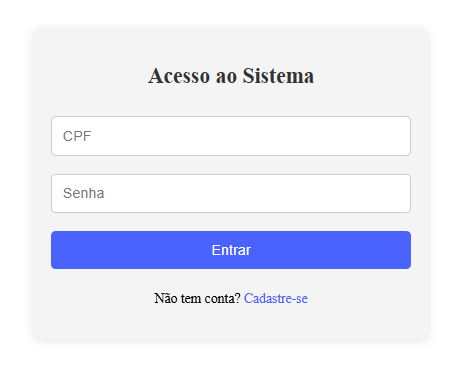
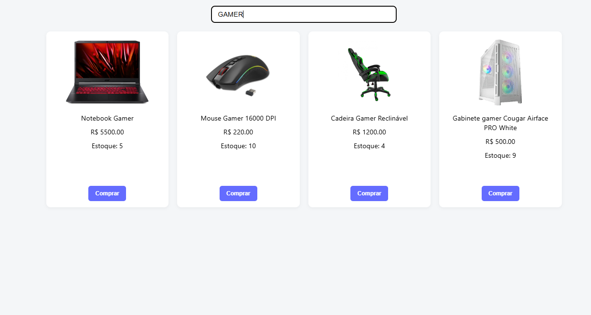
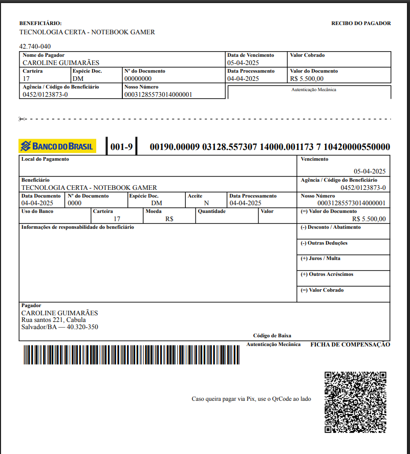

<h1 align="center"> Sistema de Gerenciamento de Estoque </h1>

✨ Principais Funcionalidades:
  
👤 Cadastro e login de usuário

  
🧾 Geração de boletos em PDF para download

  
🔍 Pesquisa de produtos

<a href="#-tecnologias">Tecnologias</a>&nbsp;&nbsp;&nbsp;|&nbsp;&nbsp;&nbsp;
<a href="#-projeto">Projeto</a>&nbsp;&nbsp;&nbsp;|&nbsp;&nbsp;&nbsp;
<a href="#-layout">Layout</a>&nbsp;&nbsp;&nbsp;|&nbsp;&nbsp;&nbsp;

 

## 🚀 Tecnologias
Esse projeto foi desenvolvido com as seguintes tecnologias:
 
- Vuejs
- Git e Github
 
## 💻 Projeto
 
O Tecnologia Certa é um sistema de gerenciamento de estoque
Um sistema de gerenciamento de estoque focado em produtos de tecnologia. A aplicação permite o controle de usuários, produtos e ainda gera boletos em PDF. 

## 🔖 Layout

